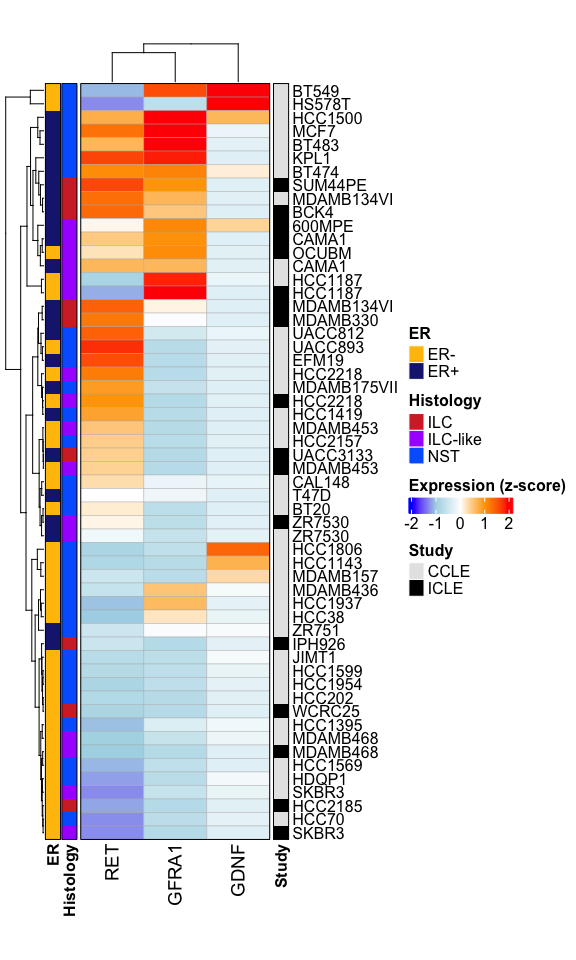

RET Activity in BRCA Cell Lines
================
2025-09-15 
<br>
Osama Shiraz Shah

# Setup

``` r
knitr::opts_chunk$set(
  fig.path = "figures/"   # saves all plots to figures/
)
```

``` r
suppressPackageStartupMessages({
  library(ComplexHeatmap)
  library(circlize)
  library(grid)
})
```

## Load Data

``` r
# Expression matrix and annotations
load("./BRCA_CL_EXP_Log2CPM.Rdata")                    
CL_Annots <- read.delim("./BRCA_CL_Subtyping.tsv", check.names = FALSE)
rownames(CL_Annots) <- CL_Annots$Name
CL_Annots$Study <- ifelse(grepl("-C", CL_Annots$Name), "CCLE", "ICLE")
```

## Define Annotation Colors

``` r
col_fun <- colorRamp2(breaks = c(-2,-1,0,1,2),
                      colors = c("blue","lightblue","white","orange","red"))

annot_cols <- list(
  Study     = c("ICLE" = "black", "CCLE" = "gray90"),
  Histology = c("ILC" = "#D32F2F","ILC-like" = "#AA00FF","NST" = "#0066ff"),
  ER        = c("ER-" = "#FFC107", "ER+" = "#1A237E")
)
```

# Select Genes and Samples

``` r
genes_of_interest <- c("RET", "GDNF", "GFRA1")          # RET activity genes
keep_hist <- c("ILC", "ILC-like", "NST")                # Histology types to keep
common_samples <- intersect(colnames(BRCA_CL_EXP),
                            rownames(subset(CL_Annots, Histology %in% keep_hist)))

CL_sub <- CL_Annots[common_samples, c("Study","Histology","ER")]
```

# Normalize Expression (z-score)

``` r
zmat <- t(scale(t(BRCA_CL_EXP[genes_of_interest, common_samples, drop = FALSE])))
if (anyNA(zmat)) zmat[is.na(zmat)] <- 0
```

# Build Heatmap

``` r
# Row-side annotations
left_anno <- HeatmapAnnotation(ER = CL_sub$ER, Histology = CL_sub$Histology, col = annot_cols, 
                               which = "row", annotation_name_side = "bottom", border = TRUE,
                               annotation_name_gp = gpar(fontsize = 12, fontface = "bold"),
                               simple_anno_size = unit(4, "mm"),
                               annotation_legend_param = list(title_gp = gpar(fontsize = 12, fontface = "bold"),
                                                              labels_gp = gpar(fontsize = 12), direction = "horizontal"))

right_anno <- HeatmapAnnotation(Study = CL_sub$Study, col = annot_cols,
                                which = "row", annotation_name_side = "bottom", border = TRUE,
                                annotation_name_gp = gpar(fontsize = 12, fontface = "bold"),
                                simple_anno_size = unit(4, "mm"),
                                annotation_legend_param = list(title_gp = gpar(fontsize = 12, fontface = "bold"),
                                                               labels_gp = gpar(fontsize = 12), direction = "horizontal"))

ht <- Heatmap(t(zmat), name = "Exp z-score", col = col_fun,
              left_annotation = left_anno, right_annotation = right_anno,
              cluster_rows = TRUE, cluster_columns = TRUE,
              show_row_names = TRUE, show_column_names = TRUE,
              width = unit(5, "cm"), height = unit(20, "cm"),
              row_labels = gsub("-C|-I", "", colnames(zmat)),
              row_names_gp = gpar(fontsize = 12),
              column_names_gp = gpar(fontsize = 14),
              rect_gp = gpar(col = "grey70", lwd = 0.4),
              border = TRUE,
              heatmap_legend_param = list(title = "Expression (z-score)",
                                          title_gp = gpar(fontsize = 12, fontface = "bold"),
                                          labels_gp = gpar(fontsize = 12),
                                          direction = "horizontal"))
```

``` r
draw(ht, merge_legends = TRUE,
     heatmap_legend_side = "right",
     annotation_legend_side = "right",
     padding = unit(c(2, 2, 2, 2), "mm"))
```

<!-- -->
